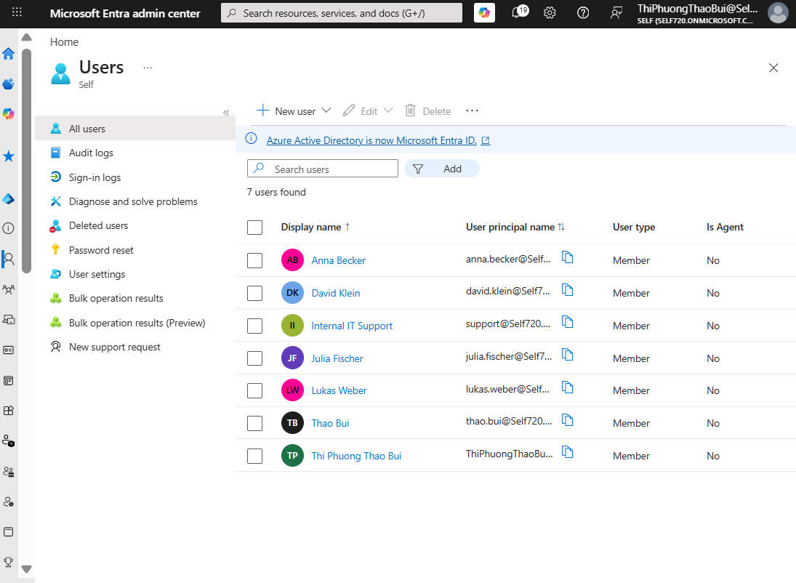
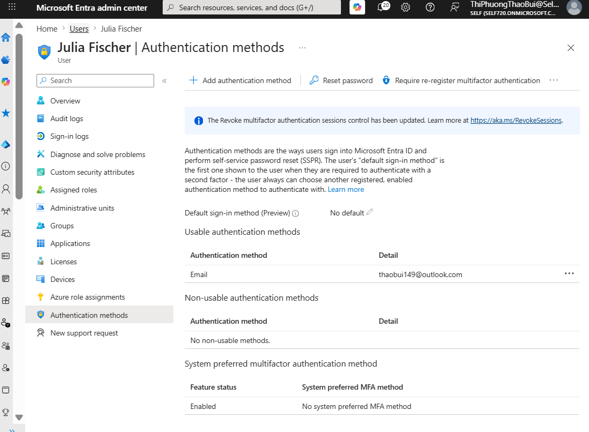
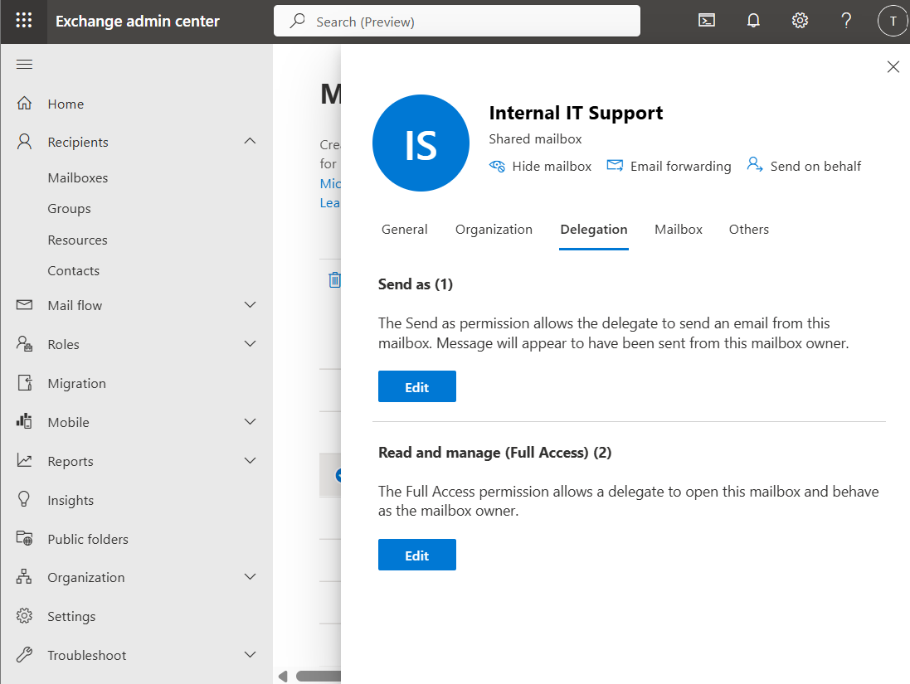
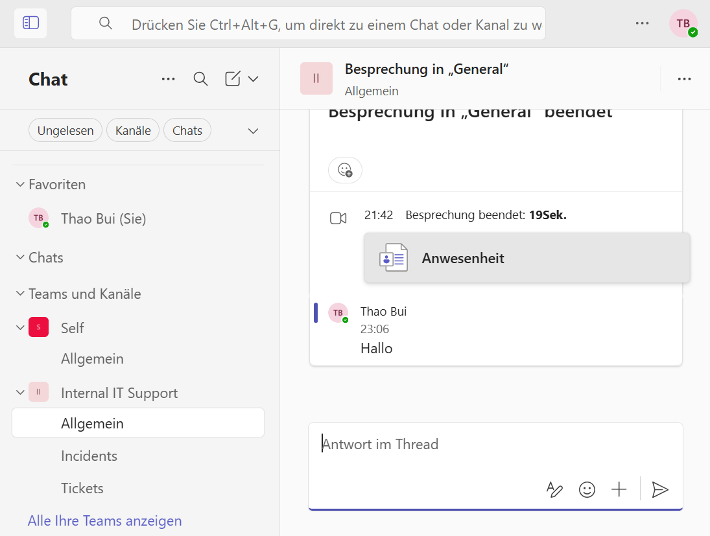
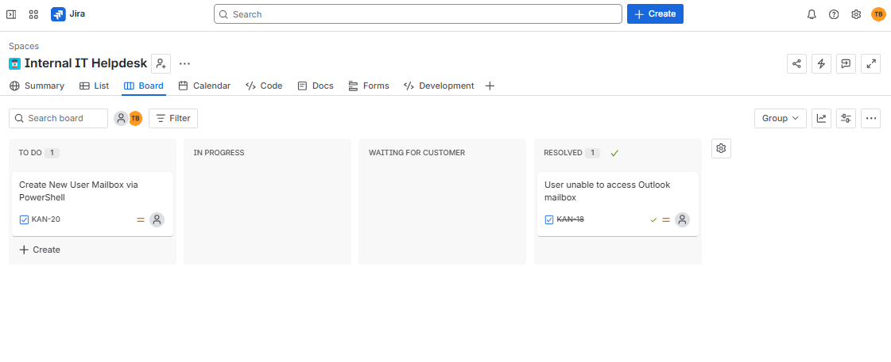
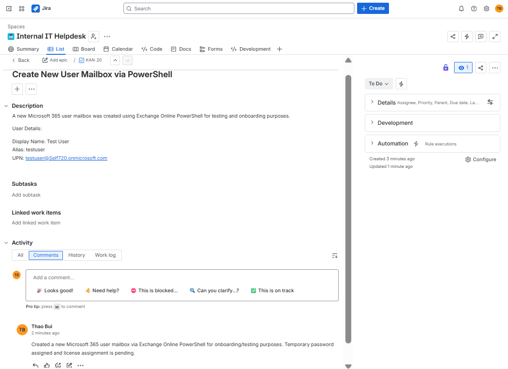

# Microsoft 365 Internal IT Support Lab

## Project Overview

This project simulates a small internal IT support environment using Microsoft 365 technologies. The lab focuses on user administration, mailbox management, troubleshooting workflows, ticket handling and basic PowerShell administration.

---

# Microsoft Entra ID

Created and managed users inside Microsoft Entra ID.

Tasks performed:
- User creation
- License assignment
- Group management
- MFA configuration

---

# MFA Configuration

Configured authentication methods and tested MFA administration scenarios.

---

# Exchange Online

Created and managed shared mailboxes and mailbox permissions.

Tasks performed:
- Shared mailbox configuration
- Full Access permissions
- Send As permissions

---

# Microsoft Teams

Created an internal IT support team with multiple channels for communication and incident handling.

Channels:
- General
- Incidents
- Tickets

---

# Jira Service Management

Created a small internal IT helpdesk project to simulate ticket workflows.

Example tasks:
- Outlook mailbox issue
- User onboarding
- Teams troubleshooting

---

# Jira Ticket Example

Example support ticket related to mailbox administration and onboarding.

---

# PowerShell Administration

Basic PowerShell administration tasks:
- Connect to Exchange Online
- Create mailbox
- Manage permissions
- User administration

---

# Skills Demonstrated

- Microsoft 365 Administration
- Microsoft Entra ID
- Exchange Online
- Microsoft Teams
- Jira Service Management
- MFA Administration
- IT Troubleshooting
- Basic PowerShell
- Ticket Management
- User & Access Management